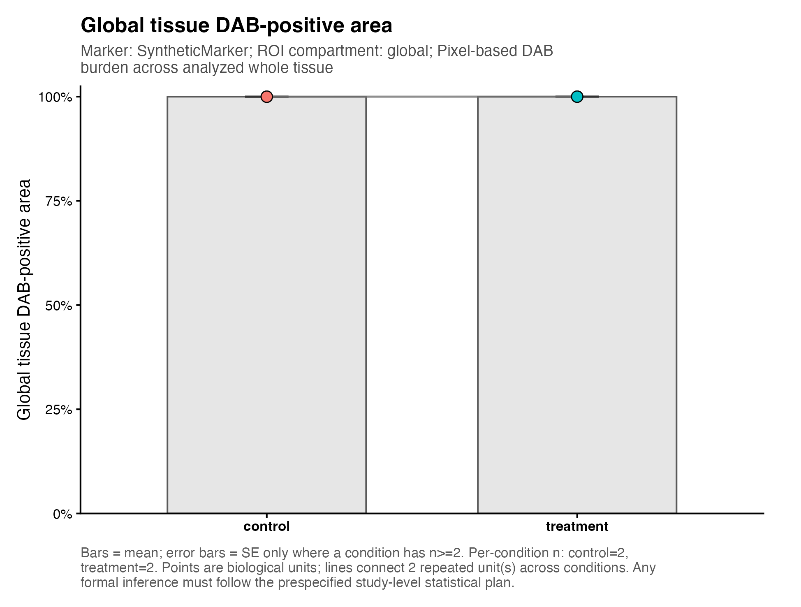
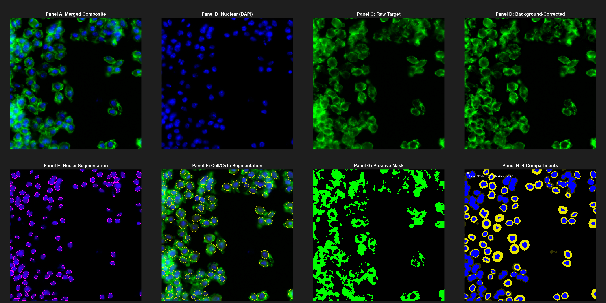
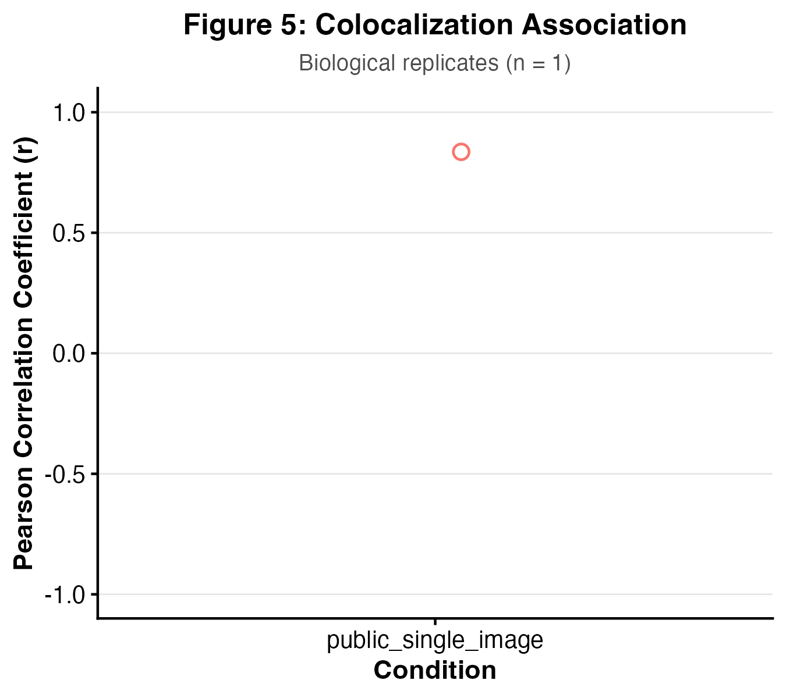
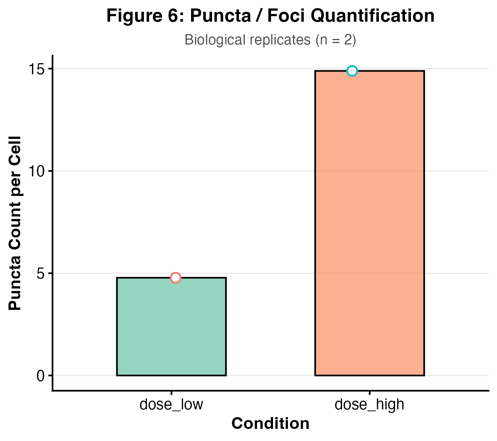

# IHC & Immunofluorescence Quantification Skill

> A QC-first, reproducible workflow for quantitative DAB-IHC and multi-channel immunofluorescence image analysis.

[](https://github.com/Potato-AI0815/ihc-quantification-skill/releases/tag/v2.3.0-rc3)
[](LICENSE)
[](https://github.com/Potato-AI0815/ihc-quantification-skill/actions)

---

## Why This Project?

Quantitative microscopy analysis in biomedical research often suffers from:
- **Inconsistent manual scoring**: Subjective visual assessment introduces substantial inter-observer and intra-observer variability.
- **Unclear QC procedures**: Optical artifacts, out-of-focus tiles, burned-in annotations, and saturated detector channels frequently distort downstream statistical conclusions without explicit warnings.
- **Poor reproducibility**: Ad-hoc scripts lack standardized input contracts, version freezing, and auditable parameter tracking.
- **Statistical overinterpretation**: Spatial co-occurrence is often incorrectly reported as physical molecular binding, or individual cells are treated as independent replicates ($n$), creating pseudo-replication.

This project provides an auditable, script-based R/EBImage workflow that converts raw microscopy images into publication-ready quantitative figures and source data tables with strict quality control and biological replicate governance.

---

## Supported Analysis

| Modality / Module | Capability | Measurement Outputs |
| :--- | :--- | :--- |
| **DAB-IHC** | Whole-tissue global burden, 4-compartment scoring, H-DAB color deconvolution | DAB optical density (OD), nuclear/cytoplasm H-score (0–300), positive area % |
| **Immunofluorescence (IF)** | Multi-channel composite & Z-stack slice/projection processing | Linear fluorescence MFI, integrated intensity, positivity fraction, N/C ratio |
| **Segmentation** | Classical morphological distance-watershed pipeline | Discrete nuclear, cytoplasmic, and cellular object masks |
| **Compartments** | 4-compartment spatial decomposition | `GLOBAL`, `NUCLEUS`, `CYTOPLASM`, `EXTRACELLULAR` |
| **Colocalization** | Dual-channel spatial intensity correlation | Pearson correlation coefficient ($r$), Manders overlap coefficients ($M_1, M_2$) |
| **Puncta / Foci** | Validated synthetic counting workflow (Difference of Gaussians bandpass) | Foci count, per-cell density, puncta mean and integrated intensity |

---

## Workflow Overview

```text
Image Input (DAB / Multi-channel IF / Hyperstack)
  │
  ▼
Input Routing & Quality Control (Saturation, Dynamic Range, Registration)
  │
  ▼
Preprocessing & Background Correction (Rolling Ball / Top-hat)
  │
  ▼
Segmentation & Compartment Partitioning (Global, Nucleus, Cytoplasm, Extracellular)
  │
  ▼
Single-Cell & Compartment-Level Quantification (MFI, H-score, Colocalization, Puncta)
  │
  ▼
QC Visualization (8-Panel Diagnostic Montage, Overlays, Excluded ROI Masks)
  │
  ▼
Publication-Ready Biological Aggregation Figures & Auditable Source Data
```

---

## Validation

The workflow has been verified across 11 comprehensive validation gates (`G0`–`G10`):

- **BBBC039 Instance Segmentation Benchmark (`G8`)**: Evaluated on the official 50-image validation partition with per-color instance decoding and greedy 1-to-1 IoU matching at $\text{IoU} \ge 0.5$ (Dice: `0.8953`, IoU: `0.8390`, Object F1: `0.8919`, Count Error: `13.0%`).
- **DAB Backward Compatibility (`G0`, `G9`)**: Exact structural and categorical agreement against the clean v2.2.2 baseline across all 11 tables; observed maximum numeric deviation `0` (acceptance tolerance `≤ 1.0×10⁻⁶` for bounded cross-platform floating-point serialization differences).
- **Cross-Platform Continuous Integration (`G10`)**: Automated GitHub Actions matrix verified on `ubuntu-latest` and `windows-latest`.

### External Real-Data Validation

Four independent public benchmarks evaluate the frozen pipelines on real data. Gate statuses are quoted from [`EXTERNAL_VALIDATION_MATRIX.csv`](EXTERNAL_VALIDATION_MATRIX.csv):

| Dataset | Modality | What is evaluated | Gate status |
| :--- | :--- | :--- | :--- |
| **BBBC007** | IF | Manual ground-truth cell/nuclear segmentation benchmark (16 fields) | `PASS_WITH_WARNINGS` |
| **BBBC013** | IF | Real biological FKHR-EGFP cytoplasm-to-nucleus translocation dose response (96 wells) | `PASS` |
| **BBBC016** | IF | Real Transfluor puncta dose association (24 wells / 72 fields) | `PASS_WITH_WARNINGS` |
| **HPA DAB-IHC** | Brightfield | Qualitative ordinal grading concordance on 64 real TMA cores (4 markers) | `PASS_WITH_WARNINGS` |

Only BBBC007 is a ground-truth segmentation benchmark; BBBC013/BBBC016 test real biological dose-response concordance, and the HPA benchmark measures qualitative ordinal grading concordance — none of these are universal performance claims or clinical validation. Weak results are reported as measured (e.g. HPA ESR1 P95 OD $\rho$ = 0.4972).

See [`RELEASE_STATUS.md`](RELEASE_STATUS.md), [`EXTERNAL_REALDATA_VALIDATION_REPORT.md`](EXTERNAL_REALDATA_VALIDATION_REPORT.md), and [`EXTERNAL_VALIDATION_MATRIX.csv`](EXTERNAL_VALIDATION_MATRIX.csv) for the current evidence. `GATE_MATRIX_FINAL.csv` and `GATE_MATRIX_RC1_FINAL.csv` are historical (rc1-era) gate snapshots retained as archived validation evidence.

---

## Example Outputs

The gallery deliberately labels provenance. The IF QC and colocalization outputs
below were generated by running this workflow on public teaching datasets. The
DAB-IHC and puncta panels are deterministic synthetic fixtures because this
release does not bundle a public DAB-IHC or public puncta run. None of these
images should be interpreted as a biological benchmark or clinical result.

| DAB-IHC global burden (synthetic fixture) | IF 8-panel QC (public BBBC007 run) |
| :---: | :---: |
|  |  |

| IF colocalization (public CIL45501 run) | IF puncta/foci (synthetic fixture) |
| :---: | :---: |
|  |  |

Public-data provenance, source links, and the interpretation limits of the
single-image demonstrations are documented in
[`docs/public_demo_provenance.md`](docs/public_demo_provenance.md).

Each execution automatically generates an auditable, structured output directory:
- **Quantitative Tables (`source_data/`)**: Per-cell measurements (`if_cell_summary.csv.gz`), 4-compartment summaries, biological unit aggregations, and metric dictionaries.
- **QC Reports & Diagnostics (`qc/`)**: Standardized 8-panel IF overview montage (`*_if_8panel_qc.png`), H-DAB deconvolution overlays, and reviewed ROI exclusion audits.
- **Publication Figures (`figures/main/`)**: Vector and raster comparison plots (Figures 1–6 in SVG, PDF, PNG) aggregated by `biological_unit_id` ($n$).
- **Audit-Friendly Metadata**: Input validation logs, channel metadata, and parameter manifests for reproducible manuscript reporting.

---

## Scientific Interpretation Boundaries

> [!IMPORTANT]
> ### 1. Colocalization
> High colocalization scores ($r, M_1, M_2$) demonstrate spatial pixel intensity correlation within optical resolution limits; **colocalization does not establish molecular binding or physical complex formation** without complementary biophysical assays (e.g. FRET, PLA, Co-IP).
>
> ### 2. Puncta / Subcellular Foci
> The puncta module is validated for synthetic aggregate count recovery and dose-response ranking. It does not represent universal diffraction-limited single-molecule localization.
>
> ### 3. OME-TIFF & Formats
> Supports standard TIFF and ImageJ-compatible hyperstacks ($X \times Y \times C \times Z$). Native Bio-Formats OME-XML metadata-aware ingestion workflows remain under validation.
>
> ### 4. Research Use Only (RUO)
> This software is strictly for reproducible academic and industrial research quantification. It is **not** a clinical diagnostic tool or medical device.

---

## Installation & Quick Start

### 1. Clone Repository
```bash
git clone https://github.com/Potato-AI0815/ihc-quantification-skill.git
cd ihc-quantification-skill
```

### 2. Environment Setup (R & Python)
```bash
# Install required R packages (EBImage, data.table, ggplot2, ragg, svglite, tiff)
Rscript scripts/install_dependencies.R --lib=Rlib
```

### 3. Run Synthetic Smoke Test
```bash
# Linux / macOS
bash tests/run_synthetic_smoke_test.sh

# Windows
powershell -ExecutionPolicy Bypass -File .\tests\run_synthetic_smoke_test.ps1
```

### 4. Run Analysis on Your Data
```bash
# Automatically routes between DAB-IHC and Multi-channel IF based on manifest.csv
bash run_one_click.sh \
  "path/to/manifest.csv" \
  "results/my_analysis_run" \
  "" \
  "config/if_analysis_parameters_template.csv" \
  "Rlib" \
  "control,treatment"
```

---

## Documentation

- [Full Analysis Contract & Specification (SKILL.md)](SKILL.md)
- [Methodology & Scientific Governance](docs/immunofluorescence_methodology.md)
- [Input Formats & Axis Ordering Guide](docs/if_input_guide.md)
- [Channel Mapping Guide](docs/if_channel_mapping.md)
- [Segmentation & 4-Compartment Guide](docs/if_segmentation_guide.md)
- [Colocalization Analysis Guide](docs/if_colocalization_guide.md)
- [Puncta Detection Guide](docs/if_puncta_guide.md)
- [Quality Control & Flagging Guide](docs/if_qc_guide.md)
- [Public Benchmark Dataset Guide](docs/if_validation_datasets.md)

---

## Citation

If you use this workflow in your research, please cite according to [`CITATION.cff`](CITATION.cff).

---

## Contributing

We welcome community contributions, bug reports, and benchmark datasets!
- **Issues**: Report bugs or unexpected image behaviors via [GitHub Issues](https://github.com/Potato-AI0815/ihc-quantification-skill/issues).
- **Feature Requests & Feedback**: Submit suggestions for new microscopy modalities or preprocessing filters.
- **Benchmark Contributions**: Submit annotated ground-truth datasets to expand public validation coverage.

---

## License

This project is licensed under the MIT License — see [`LICENSE`](LICENSE) for details.
